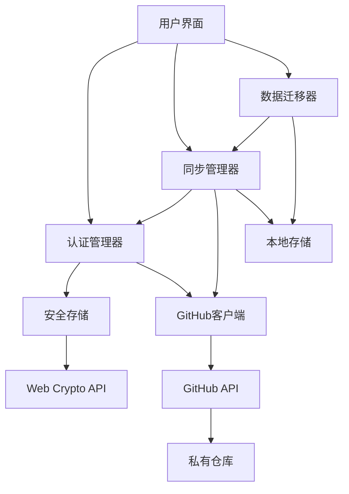
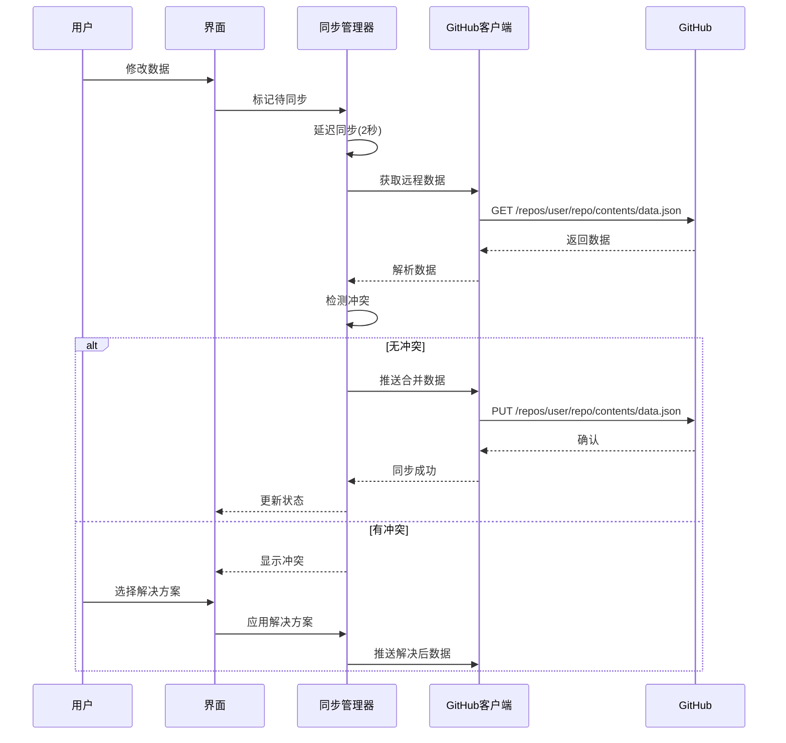
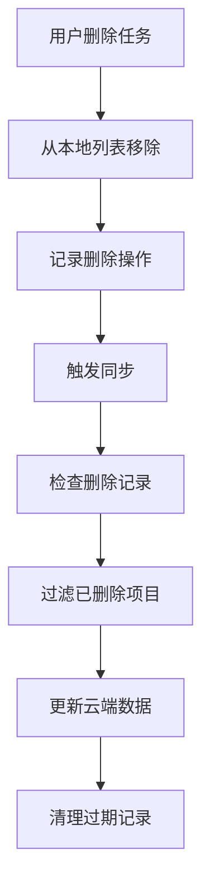

# 🔄 GitHub云端同步技术方案

基于GitHub私有仓库的客户端数据同步解决方案

## 📋 目录

1. [概述](#概述)
2. [技术架构](#技术架构)
3. [核心模块](#核心模块)
4. [实现步骤](#实现步骤)
5. [安全设计](#安全设计)
6. [API接口](#API接口)
7. [错误处理](#错误处理)
8. [性能优化](#性能优化)
9. [部署考虑](#部署考虑)
10. [代码示例](#代码示例)

## 概述

### 🎯 解决方案目标

- **跨设备同步**: 在多个设备间同步应用数据
- **数据安全**: 用户完全控制数据，存储在私有GitHub仓库
- **离线支持**: 网络断开时继续工作，连接后自动同步
- **冲突处理**: 智能检测并解决多设备间的数据冲突
- **用户友好**: 简单的配置流程，透明的同步状态

### 🏗️ 架构特点

- **客户端架构**: 所有逻辑在浏览器中执行
- **去中心化**: 不依赖第三方服务器
- **安全加密**: 敏感数据本地加密存储
- **渐进增强**: 从本地存储平滑升级到云端同步

## 技术架构

### 整体架构图



### 数据流程



## 核心模块

### 1. 类型定义 (`lib/types.ts`)

```typescript
// GitHub 相关类型
export interface GitHubUser {
  login: string
  id: number
  avatar_url: string
  email?: string
}

export interface GitHubRepository {
  name: string
  full_name: string
  private: boolean
  default_branch: string
}

export interface GitHubPermissions {
  read: boolean
  write: boolean
  admin: boolean
  rateLimit: RateLimit
}

export interface RateLimit {
  limit: number
  remaining: number
  reset: number
  used: number
}

// 应用数据类型
export interface HabitItem {
  id: string
  text: string
  completed: boolean
  hidden: boolean
  createdAt: string
  updatedAt?: string
}

export interface HabitsData {
  version: string
  lastSync: string
  lastResetDate: string
  habits: HabitItem[]
  settings: {
    theme: string
    autoSync: boolean
    syncInterval: number
    encryptionEnabled: boolean
  }
}

// 同步相关类型
export type SyncStatus = 'idle' | 'syncing' | 'success' | 'error' | 'conflict' | 'offline'

export interface ConflictInfo {
  id: string
  type: 'modify' | 'delete' | 'add'
  local?: HabitItem
  remote?: HabitItem
  timestamp: {
    local: string
    remote: string
  }
}

export type ConflictResolution = 'local' | 'remote' | 'merge'

export interface SyncResult {
  success: boolean
  conflicts: ConflictInfo[]
  lastSyncTime: Date
  syncedRecords: number
  error?: string
}

export class SyncError extends Error {
  constructor(
    message: string,
    public type: 'auth' | 'network' | 'storage' | 'conflict'
  ) {
    super(message)
    this.name = 'SyncError'
  }
}
```

### 2. 安全存储 (`lib/secure-storage.ts`)

```typescript
class SecureStorage {
  private static instance: SecureStorage
  private encryptionKey: CryptoKey | null = null

  static getInstance(): SecureStorage {
    if (!SecureStorage.instance) {
      SecureStorage.instance = new SecureStorage()
    }
    return SecureStorage.instance
  }

  // 生成设备指纹作为加密密钥
  private async generateDeviceFingerprint(): Promise<string> {
    const canvas = document.createElement('canvas')
    const ctx = canvas.getContext('2d')!
    ctx.textBaseline = 'top'
    ctx.font = '14px Arial'
    ctx.fillText('Device fingerprint', 2, 2)
    
    const fingerprint = [
      navigator.userAgent,
      navigator.language,
      screen.width + 'x' + screen.height,
      new Date().getTimezoneOffset(),
      canvas.toDataURL()
    ].join('|')
    
    return btoa(fingerprint).slice(0, 32)
  }

  // 获取加密密钥
  private async getEncryptionKey(): Promise<CryptoKey> {
    if (this.encryptionKey) return this.encryptionKey

    const fingerprint = await this.generateDeviceFingerprint()
    const keyMaterial = await crypto.subtle.importKey(
      'raw',
      new TextEncoder().encode(fingerprint),
      'PBKDF2',
      false,
      ['deriveBits', 'deriveKey']
    )

    this.encryptionKey = await crypto.subtle.deriveKey(
      {
        name: 'PBKDF2',
        salt: new TextEncoder().encode('daily-habits-salt'),
        iterations: 100000,
        hash: 'SHA-256'
      },
      keyMaterial,
      { name: 'AES-GCM', length: 256 },
      false,
      ['encrypt', 'decrypt']
    )

    return this.encryptionKey
  }

  // 加密数据
  async encrypt(data: string): Promise<string> {
    const key = await this.getEncryptionKey()
    const iv = crypto.getRandomValues(new Uint8Array(12))
    const encodedData = new TextEncoder().encode(data)

    const encrypted = await crypto.subtle.encrypt(
      { name: 'AES-GCM', iv },
      key,
      encodedData
    )

    const combined = new Uint8Array(iv.length + encrypted.byteLength)
    combined.set(iv)
    combined.set(new Uint8Array(encrypted), iv.length)

    return btoa(String.fromCharCode.apply(null, combined))
  }

  // 解密数据
  async decrypt(encryptedData: string): Promise<string> {
    const key = await this.getEncryptionKey()
    const combined = Uint8Array.from(atob(encryptedData), c => c.charCodeAt(0))
    const iv = combined.slice(0, 12)
    const encrypted = combined.slice(12)

    const decrypted = await crypto.subtle.decrypt(
      { name: 'AES-GCM', iv },
      key,
      encrypted
    )

    return new TextDecoder().decode(decrypted)
  }

  // 安全存储项目
  async setItem<T>(key: string, value: T, encrypt = true): Promise<void> {
    try {
      const stringValue = JSON.stringify(value)
      
      if (encrypt) {
        const encryptedValue = await this.encrypt(stringValue)
        localStorage.setItem(`encrypted_${key}`, encryptedValue)
      } else {
        localStorage.setItem(key, stringValue)
      }
    } catch (error) {
      throw new Error(`Failed to store ${key}: ${error}`)
    }
  }

  // 安全获取项目
  async getItem<T>(key: string, encrypted = true): Promise<T | null> {
    try {
      const storageKey = encrypted ? `encrypted_${key}` : key
      const storedValue = localStorage.getItem(storageKey)
      
      if (!storedValue) return null

      let decryptedValue: string
      if (encrypted) {
        decryptedValue = await this.decrypt(storedValue)
      } else {
        decryptedValue = storedValue
      }

      return JSON.parse(decryptedValue)
    } catch (error) {
      console.error(`Failed to retrieve ${key}:`, error)
      return null
    }
  }

  // 删除项目
  removeItem(key: string, encrypted = true): void {
    const storageKey = encrypted ? `encrypted_${key}` : key
    localStorage.removeItem(storageKey)
  }

  // 清除所有加密数据
  clearEncryptedData(): void {
    const keysToRemove: string[] = []
    for (let i = 0; i < localStorage.length; i++) {
      const key = localStorage.key(i)
      if (key && key.startsWith('encrypted_')) {
        keysToRemove.push(key)
      }
    }
    keysToRemove.forEach(key => localStorage.removeItem(key))
  }
}

export const secureStorage = SecureStorage.getInstance()
```

### 3. GitHub API客户端 (`lib/github-client.ts`)

```typescript
class GitHubClient {
  private token: string
  private baseURL = 'https://api.github.com'
  private rateLimitInfo: RateLimit | null = null

  constructor(token: string) {
    this.token = token
  }

  // 核心请求方法
  private async request<T>(
    endpoint: string,
    options: RequestInit = {}
  ): Promise<GitHubAPIResponse<T>> {
    const url = `${this.baseURL}${endpoint}`
    
    const response = await fetch(url, {
      ...options,
      headers: {
        'Authorization': `Bearer ${this.token}`,
        'Accept': 'application/vnd.github.v3+json',
        'Content-Type': 'application/json',
        ...options.headers
      }
    })

    // 更新速率限制信息
    this.updateRateLimitInfo(response)

    if (!response.ok) {
      throw new Error(`GitHub API error: ${response.status} ${response.statusText}`)
    }

    const data = await response.json()
    return { data, status: response.status, headers: response.headers }
  }

  // 验证令牌并获取用户信息
  async validateToken(): Promise<GitHubUser> {
    const response = await this.request<GitHubUser>('/user')
    return response.data
  }

  // 检查权限
  async checkPermissions(): Promise<GitHubPermissions> {
    try {
      // 检查基本读写权限
      await this.request('/user/repos', { method: 'GET' })
      
      return {
        read: true,
        write: true,
        admin: false,
        rateLimit: this.rateLimitInfo || {
          limit: 5000,
          remaining: 5000,
          reset: Date.now() + 3600000,
          used: 0
        }
      }
    } catch (error) {
      throw new Error('Token lacks required permissions')
    }
  }

  // 创建仓库
  async createRepository(
    name: string,
    description: string,
    isPrivate = true
  ): Promise<GitHubRepository> {
    const response = await this.request<GitHubRepository>('/user/repos', {
      method: 'POST',
      body: JSON.stringify({
        name,
        description,
        private: isPrivate,
        auto_init: true
      })
    })
    return response.data
  }

  // 检查仓库是否存在
  async repositoryExists(owner: string, repo: string): Promise<boolean> {
    try {
      await this.request(`/repos/${owner}/${repo}`)
      return true
    } catch {
      return false
    }
  }

  // 读取文件内容
  async readFileContent(
    owner: string,
    repo: string,
    path: string,
    branch = 'main'
  ): Promise<{ content: string; sha: string }> {
    const response = await this.request<{
      content: string
      sha: string
    }>(`/repos/${owner}/${repo}/contents/${path}?ref=${branch}`)

    const content = atob(response.data.content.replace(/\n/g, ''))
    return { content, sha: response.data.sha }
  }

  // 写入文件内容
  async writeFileContent(
    owner: string,
    repo: string,
    path: string,
    content: string,
    message: string,
    sha?: string,
    branch = 'main'
  ): Promise<void> {
    const body: any = {
      message,
      content: btoa(content),
      branch
    }

    if (sha) {
      body.sha = sha
    }

    await this.request(`/repos/${owner}/${repo}/contents/${path}`, {
      method: 'PUT',
      body: JSON.stringify(body)
    })
  }

  // 读取习惯数据
  async readHabitsData(owner: string, repo: string): Promise<HabitsData> {
    try {
      const { content } = await this.readFileContent(owner, repo, 'habits.json')
      return JSON.parse(content)
    } catch (error) {
      // 如果文件不存在，返回默认数据
      return {
        version: '1.0',
        lastSync: new Date().toISOString(),
        lastResetDate: new Date().toDateString(),
        habits: [],
        settings: {
          theme: 'light',
          autoSync: true,
          syncInterval: 300000,
          encryptionEnabled: true
        }
      }
    }
  }

  // 写入习惯数据
  async writeHabitsData(
    owner: string,
    repo: string,
    data: HabitsData
  ): Promise<void> {
    try {
      // 尝试获取现有文件的SHA
      const { sha } = await this.readFileContent(owner, repo, 'habits.json')
      
      await this.writeFileContent(
        owner,
        repo,
        'habits.json',
        JSON.stringify(data, null, 2),
        `Update habits data - ${new Date().toISOString()}`,
        sha
      )
    } catch {
      // 文件不存在，创建新文件
      await this.writeFileContent(
        owner,
        repo,
        'habits.json',
        JSON.stringify(data, null, 2),
        'Initial habits data'
      )
    }
  }

  // 更新速率限制信息
  private updateRateLimitInfo(response: Response): void {
    const limit = response.headers.get('x-ratelimit-limit')
    const remaining = response.headers.get('x-ratelimit-remaining')
    const reset = response.headers.get('x-ratelimit-reset')
    const used = response.headers.get('x-ratelimit-used')

    if (limit && remaining && reset) {
      this.rateLimitInfo = {
        limit: parseInt(limit),
        remaining: parseInt(remaining),
        reset: parseInt(reset) * 1000,
        used: parseInt(used || '0')
      }
    }
  }

  // 获取速率限制信息
  getRateLimitInfo(): RateLimit | null {
    return this.rateLimitInfo
  }
}
```

### 4. 认证管理器 (`lib/auth-manager.ts`)

```typescript
class AuthManager {
  private static instance: AuthManager
  private client: GitHubClient | null = null
  private authState: AuthState = { isAuthenticated: false }
  private listeners: Array<(state: AuthState) => void> = []

  static getInstance(): AuthManager {
    if (!AuthManager.instance) {
      AuthManager.instance = new AuthManager()
    }
    return AuthManager.instance
  }

  // 初始化认证状态
  async initialize(): Promise<void> {
    try {
      const authConfig = await secureStorage.getItem<AuthConfig>('auth_config')
      if (authConfig) {
        await this.validateStoredAuth(authConfig)
      }
    } catch (error) {
      console.error('Failed to initialize auth:', error)
      this.clearAuth()
    }
  }

  // 验证并设置令牌
  async authenticateWithToken(token: string): Promise<AuthResult> {
    try {
      this.client = new GitHubClient(token)
      
      // 验证令牌
      const user = await this.client.validateToken()
      const permissions = await this.client.checkPermissions()

      // 检查或创建仓库
      const repository = await this.ensureRepository(user.login, 'daily-habits-data')

      // 保存认证配置
      const authConfig: AuthConfig = {
        token,
        userId: user.id,
        username: user.login,
        repoFullName: repository.full_name
      }
      
      await secureStorage.setItem('auth_config', authConfig)

      // 更新认证状态
      this.authState = {
        isAuthenticated: true,
        user,
        permissions,
        repository
      }

      this.notifyListeners()

      return {
        success: true,
        user,
        repository
      }
    } catch (error) {
      this.clearAuth()
      throw new Error(`Authentication failed: ${error}`)
    }
  }

  // 确保仓库存在
  private async ensureRepository(
    username: string,
    repoName: string
  ): Promise<GitHubRepository> {
    if (!this.client) throw new Error('Client not initialized')

    try {
      const exists = await this.client.repositoryExists(username, repoName)
      
      if (exists) {
        const response = await this.client.makeRequest<GitHubRepository>(
          `/repos/${username}/${repoName}`
        )
        return response.data
      } else {
        return await this.client.createRepository(
          repoName,
          '日拱一足 - 个人习惯数据存储仓库（自动创建）'
        )
      }
    } catch (error) {
      throw new Error(`Failed to ensure repository: ${error}`)
    }
  }

  // 验证存储的认证信息
  private async validateStoredAuth(authConfig: AuthConfig): Promise<void> {
    this.client = new GitHubClient(authConfig.token)
    
    try {
      const user = await this.client.validateToken()
      const permissions = await this.client.checkPermissions()

      const repository = await this.client.makeRequest<GitHubRepository>(
        `/repos/${authConfig.repoFullName}`
      ).then(response => response.data).catch(() => null)

      this.authState = {
        isAuthenticated: true,
        user,
        permissions,
        repository
      }

      this.notifyListeners()
    } catch (error) {
      this.clearAuth()
      throw error
    }
  }

  // 清除认证信息
  clearAuth(): void {
    this.client = null
    this.authState = { isAuthenticated: false }
    secureStorage.removeItem('auth_config')
    this.notifyListeners()
  }

  // 获取当前认证状态
  getAuthState(): AuthState {
    return { ...this.authState }
  }

  // 检查是否已认证
  isAuthenticated(): boolean {
    return this.authState.isAuthenticated
  }

  // 获取客户端实例
  getClient(): GitHubClient {
    if (!this.client) {
      throw new Error('Not authenticated')
    }
    return this.client
  }

  // 获取用户信息
  getUser(): GitHubUser | null {
    return this.authState.user || null
  }

  // 获取仓库信息
  getRepository(): GitHubRepository | null {
    return this.authState.repository || null
  }

  // 监听认证状态变化
  onAuthStateChange(listener: (state: AuthState) => void): () => void {
    this.listeners.push(listener)
    
    return () => {
      const index = this.listeners.indexOf(listener)
      if (index > -1) {
        this.listeners.splice(index, 1)
      }
    }
  }

  // 通知监听器
  private notifyListeners(): void {
    this.listeners.forEach(listener => {
      try {
        listener(this.getAuthState())
      } catch (error) {
        console.error('Auth state listener error:', error)
      }
    })
  }
}

export const authManager = AuthManager.getInstance()
```

### 5. 同步管理器 (`lib/sync-manager.ts`)

```typescript
class SyncManager {
  private static instance: SyncManager
  private syncState: SyncState
  private config: SyncConfig
  private listeners: Array<(state: SyncState) => void> = []
  private syncTimer: NodeJS.Timeout | null = null
  private isOnline = true

  static getInstance(): SyncManager {
    if (!SyncManager.instance) {
      SyncManager.instance = new SyncManager()
    }
    return SyncManager.instance
  }

  // 执行完整同步
  async sync(): Promise<SyncResult> {
    if (!authManager.isAuthenticated()) {
      throw new SyncError('Not authenticated', 'auth')
    }

    if (!this.isOnline) {
      throw new SyncError('Network unavailable', 'network')
    }

    this.updateSyncState({ status: 'syncing', lastError: null })

    try {
      const localData = await this.getLocalData()
      const remoteData = await this.getRemoteData()

      // 检测冲突
      const conflicts = this.detectConflicts(localData, remoteData)

      if (conflicts.length > 0) {
        this.updateSyncState({ 
          status: 'conflict', 
          conflictCount: conflicts.length 
        })
        
        return {
          success: false,
          conflicts,
          lastSyncTime: new Date(),
          syncedRecords: 0,
          error: `发现 ${conflicts.length} 个数据冲突，需要手动解决`
        }
      }

      // 合并数据
      const mergedData = this.mergeData(localData, remoteData)

      // 保存到本地和远程
      await Promise.all([
        this.saveLocalData(mergedData),
        this.saveRemoteData(mergedData)
      ])

      const now = new Date()
      this.updateSyncState({
        status: 'success',
        lastSyncTime: now,
        pendingChanges: false,
        conflictCount: 0
      })

      return {
        success: true,
        conflicts: [],
        lastSyncTime: now,
        syncedRecords: mergedData.habits.length
      }
    } catch (error) {
      const errorMessage = error instanceof Error ? error.message : '同步失败'
      
      this.updateSyncState({ 
        status: 'error',
        lastError: errorMessage
      })

      throw new SyncError(errorMessage, 'storage')
    }
  }

  // 检测数据冲突
  detectConflicts(local: HabitsData, remote: HabitsData): ConflictInfo[] {
    const conflicts: ConflictInfo[] = []
    const localHabits = new Map(local.habits.map(h => [h.id, h]))
    const remoteHabits = new Map(remote.habits.map(h => [h.id, h]))

    for (const [id, localHabit] of localHabits) {
      const remoteHabit = remoteHabits.get(id)
      
      if (remoteHabit && this.hasConflict(localHabit, remoteHabit)) {
        conflicts.push({
          id,
          type: 'modify',
          local: localHabit,
          remote: remoteHabit,
          timestamp: {
            local: localHabit.updatedAt || localHabit.createdAt,
            remote: remoteHabit.updatedAt || remoteHabit.createdAt
          }
        })
      }
    }

    return conflicts
  }

  // 检查是否有冲突
  private hasConflict(local: HabitItem, remote: HabitItem): boolean {
    if (local.text !== remote.text) return true
    
    if (local.completed !== remote.completed) {
      const localTime = new Date(local.updatedAt || local.createdAt).getTime()
      const remoteTime = new Date(remote.updatedAt || remote.createdAt).getTime()
      const timeDiff = Math.abs(localTime - remoteTime)
      
      return timeDiff < 60 * 60 * 1000 // 1小时内的修改认为是冲突
    }

    return false
  }

  // 合并数据
  private mergeData(local: HabitsData, remote: HabitsData): HabitsData {
    const localHabits = new Map(local.habits.map(h => [h.id, h]))
    const remoteHabits = new Map(remote.habits.map(h => [h.id, h]))
    const mergedHabits: HabitItem[] = []

    const allIds = new Set([...localHabits.keys(), ...remoteHabits.keys()])

    for (const id of allIds) {
      const localHabit = localHabits.get(id)
      const remoteHabit = remoteHabits.get(id)

      if (localHabit && remoteHabit) {
        const localTime = new Date(localHabit.updatedAt || localHabit.createdAt).getTime()
        const remoteTime = new Date(remoteHabit.updatedAt || remoteHabit.createdAt).getTime()
        
        mergedHabits.push(localTime >= remoteTime ? localHabit : remoteHabit)
      } else if (localHabit) {
        mergedHabits.push(localHabit)
      } else if (remoteHabit) {
        mergedHabits.push(remoteHabit)
      }
    }

    return {
      version: '1.0',
      lastSync: new Date().toISOString(),
      lastResetDate: local.lastResetDate,
      habits: mergedHabits.sort((a, b) => 
        new Date(a.createdAt).getTime() - new Date(b.createdAt).getTime()
      ),
      settings: { ...remote.settings, ...local.settings }
    }
  }

  // 标记有待同步的更改
  markPendingChanges(): void {
    this.updateSyncState({ pendingChanges: true })
  }

  // 手动触发同步
  async manualSync(): Promise<SyncResult> {
    return this.sync()
  }

  // 获取同步状态
  getSyncState(): SyncState {
    return { ...this.syncState }
  }

  // 监听同步状态变化
  onSyncStateChange(listener: (state: SyncState) => void): () => void {
    this.listeners.push(listener)
    
    return () => {
      const index = this.listeners.indexOf(listener)
      if (index > -1) {
        this.listeners.splice(index, 1)
      }
    }
  }
}

export const syncManager = SyncManager.getInstance()
```

## 实现步骤

### 第一阶段：基础设施

1. **创建类型定义**
   ```bash
   touch lib/types.ts
   ```
   - 定义所有TypeScript接口
   - GitHub API响应类型
   - 应用数据结构
   - 同步状态枚举

2. **实现安全存储**
   ```bash
   touch lib/secure-storage.ts
   ```
   - Web Crypto API加密
   - 设备指纹生成
   - AES-256-GCM加密算法
   - 本地存储封装

3. **GitHub API客户端**
   ```bash
   touch lib/github-client.ts
   ```
   - REST API封装
   - 错误处理
   - 速率限制监控
   - 文件操作方法

### 第二阶段：认证系统

4. **认证管理器**
   ```bash
   touch lib/auth-manager.ts
   ```
   - 令牌验证
   - 用户信息管理
   - 仓库自动创建
   - 状态监听机制

5. **认证UI组件**
   ```bash
   mkdir -p components/auth
   touch components/auth/auth-setup.tsx
   ```
   - 令牌输入界面
   - 验证流程
   - 错误提示
   - 成功回调

### 第三阶段：同步功能

6. **同步管理器**
   ```bash
   touch lib/sync-manager.ts
   ```
   - 双向同步逻辑
   - 冲突检测算法
   - 智能合并策略
   - 自动同步定时器

7. **数据迁移工具**
   ```bash
   touch lib/data-migration.ts
   ```
   - 本地数据检测
   - 云端迁移流程
   - 备份和恢复
   - 数据统计

### 第四阶段：UI集成

8. **同步状态组件**
   ```bash
   mkdir -p components/sync
   touch components/sync/sync-status.tsx
   ```
   - 实时状态显示
   - 网络状态监控
   - 手动同步按钮
   - 错误信息展示

9. **主应用集成**
   - 导入同步管理器
   - 添加状态监听
   - 集成UI组件
   - 自动同步触发

## 安全设计

### 数据加密

```typescript
// AES-256-GCM 加密实现
const encryptData = async (data: string, key: CryptoKey): Promise<string> => {
  const iv = crypto.getRandomValues(new Uint8Array(12))
  const encodedData = new TextEncoder().encode(data)
  
  const encrypted = await crypto.subtle.encrypt(
    { name: 'AES-GCM', iv },
    key,
    encodedData
  )
  
  // 合并IV和加密数据
  const combined = new Uint8Array(iv.length + encrypted.byteLength)
  combined.set(iv)
  combined.set(new Uint8Array(encrypted), iv.length)
  
  return btoa(String.fromCharCode.apply(null, combined))
}
```

### 设备指纹

```typescript
// 生成唯一设备标识
const generateDeviceFingerprint = (): string => {
  const canvas = document.createElement('canvas')
  const ctx = canvas.getContext('2d')!
  ctx.textBaseline = 'top'
  ctx.font = '14px Arial'
  ctx.fillText('Device fingerprint', 2, 2)
  
  return [
    navigator.userAgent,
    navigator.language,
    screen.width + 'x' + screen.height,
    new Date().getTimezoneOffset(),
    canvas.toDataURL()
  ].join('|')
}
```

### 权限检查

```typescript
// GitHub令牌权限验证
const validatePermissions = async (client: GitHubClient): Promise<void> => {
  try {
    // 检查用户信息访问权限
    await client.request('/user')
    
    // 检查仓库操作权限
    await client.request('/user/repos')
    
    // 检查创建仓库权限（尝试列表操作）
    await client.request('/user/repos', { 
      method: 'GET',
      headers: { 'Per-Page': '1' }
    })
  } catch (error) {
    throw new Error('Insufficient permissions')
  }
}
```

## API接口

### 认证接口

```typescript
interface AuthManager {
  // 令牌认证
  authenticateWithToken(token: string): Promise<AuthResult>
  
  // 清除认证
  clearAuth(): void
  
  // 获取认证状态
  getAuthState(): AuthState
  
  // 监听状态变化
  onAuthStateChange(listener: (state: AuthState) => void): () => void
}
```

### 同步接口

```typescript
interface SyncManager {
  // 执行同步
  sync(): Promise<SyncResult>
  
  // 手动同步
  manualSync(): Promise<SyncResult>
  
  // 推送数据
  push(data?: HabitsData): Promise<void>
  
  // 拉取数据
  pull(): Promise<HabitsData>
  
  // 解决冲突
  resolveConflicts(
    conflicts: ConflictInfo[], 
    resolutions: ConflictResolution[]
  ): Promise<HabitsData>
  
  // 标记更改
  markPendingChanges(): void
  
  // 获取状态
  getSyncState(): SyncState
  
  // 监听状态
  onSyncStateChange(listener: (state: SyncState) => void): () => void
}
```

### GitHub客户端接口

```typescript
interface GitHubClient {
  // 验证令牌
  validateToken(): Promise<GitHubUser>
  
  // 检查权限
  checkPermissions(): Promise<GitHubPermissions>
  
  // 创建仓库
  createRepository(name: string, description: string): Promise<GitHubRepository>
  
  // 读取文件
  readFileContent(owner: string, repo: string, path: string): Promise<{content: string, sha: string}>
  
  // 写入文件
  writeFileContent(
    owner: string, 
    repo: string, 
    path: string, 
    content: string, 
    message: string, 
    sha?: string
  ): Promise<void>
  
  // 读取习惯数据
  readHabitsData(owner: string, repo: string): Promise<HabitsData>
  
  // 写入习惯数据
  writeHabitsData(owner: string, repo: string, data: HabitsData): Promise<void>
}
```

## 错误处理

### 错误类型定义

```typescript
class SyncError extends Error {
  constructor(
    message: string,
    public type: 'auth' | 'network' | 'storage' | 'conflict' | 'encoding'
  ) {
    super(message)
    this.name = 'SyncError'
  }
}

class EncodingError extends Error {
  constructor(message: string) {
    super(message)
    this.name = 'EncodingError'
  }
}

class DeletionSyncError extends Error {
  constructor(message: string, public deletedId: string) {
    super(message)
    this.name = 'DeletionSyncError'
  }
}
```

### 错误处理策略

1. **认证错误**
   - 令牌无效：提示重新配置
   - 权限不足：显示权限要求
   - 仓库不存在：自动创建

2. **网络错误**
   - 连接超时：自动重试
   - 速率限制：延迟重试
   - 服务不可用：降级到离线模式

3. **数据错误**
   - 解析失败：恢复默认数据
   - 加密失败：提示重新配置
   - 冲突无法解决：用户选择

4. **存储错误**
   - 本地存储满：清理旧数据
   - 读写权限：提示用户
   - 数据损坏：从云端恢复

5. **编码错误 (v2.1.0新增)**
   - 中文乱码：自动检测和修复
   - Base64编码失败：降级到传统方法
   - 字符集不匹配：使用 TextEncoder/Decoder

6. **删除同步错误 (v2.1.0新增)**
   - 删除记录丢失：重建删除跟踪
   - 删除冲突：智能合并删除状态
   - 删除记录过期：自动清理和同步

### 自动错误恢复机制

```typescript
// 编码错误自动恢复
private async recoverFromEncodingError(data: string): Promise<string> {
  try {
    // 尝试多种解码方法
    const methods = [
      () => this.decodeWithTextDecoder(data),
      () => this.decodeWithTraditionalMethod(data),
      () => this.decodeWithFallback(data)
    ]
    
    for (const method of methods) {
      try {
        const result = method()
        if (this.isValidUTF8(result)) {
          return result
        }
      } catch (error) {
        continue
      }
    }
    
    throw new EncodingError('All decoding methods failed')
  } catch (error) {
    // 记录错误并返回原始数据
    console.warn('Encoding recovery failed:', error)
    return data
  }
}

// 删除同步错误恢复
private async recoverFromDeletionError(deletedId: string): Promise<void> {
  try {
    // 重新标记为删除
    this.markHabitAsDeleted(deletedId)
    
    // 强制同步
    await this.sync()
    
    console.log(`Recovered deletion sync for habit: ${deletedId}`)
  } catch (error) {
    throw new DeletionSyncError(
      `Failed to recover deletion sync: ${error}`,
      deletedId
    )
  }
}
```

## 性能优化

### 1. 防抖同步

```typescript
class SyncManager {
  private syncDebounceTimer: NodeJS.Timeout | null = null
  private readonly SYNC_DELAY = 2000 // 2秒延迟

  triggerAutoSync(): void {
    if (this.syncDebounceTimer) {
      clearTimeout(this.syncDebounceTimer)
    }
    
    this.syncDebounceTimer = setTimeout(() => {
      this.sync().catch(console.error)
    }, this.SYNC_DELAY)
  }
}
```

### 2. 增量同步

```typescript
// 只同步变更的数据
const getIncrementalChanges = (
  local: HabitsData, 
  lastSync: string
): HabitItem[] => {
  return local.habits.filter(habit => {
    const habitTime = new Date(habit.updatedAt || habit.createdAt)
    const syncTime = new Date(lastSync)
    return habitTime > syncTime
  })
}
```

### 3. 压缩存储

```typescript
// 压缩习惯数据
const compressHabitsData = (data: HabitsData): string => {
  // 移除不必要的字段
  const compressed = {
    v: data.version,
    ls: data.lastSync,
    lr: data.lastResetDate,
    h: data.habits.map(h => ({
      i: h.id,
      t: h.text,
      c: h.completed ? 1 : 0,
      h: h.hidden ? 1 : 0,
      ca: h.createdAt,
      ...(h.updatedAt && { ua: h.updatedAt })
    })),
    s: data.settings
  }
  
  return JSON.stringify(compressed)
}
```

### 4. 缓存策略

```typescript
class GitHubClient {
  private cache = new Map<string, {data: any, expiry: number}>()
  private readonly CACHE_DURATION = 5 * 60 * 1000 // 5分钟

  private async requestWithCache<T>(
    endpoint: string,
    options: RequestInit = {}
  ): Promise<T> {
    const cacheKey = `${endpoint}:${JSON.stringify(options)}`
    const cached = this.cache.get(cacheKey)
    
    if (cached && cached.expiry > Date.now()) {
      return cached.data
    }
    
    const response = await this.request<T>(endpoint, options)
    
    // 缓存GET请求
    if (!options.method || options.method === 'GET') {
      this.cache.set(cacheKey, {
        data: response.data,
        expiry: Date.now() + this.CACHE_DURATION
      })
    }
    
    return response.data
  }
}
```

## 部署考虑

### 环境变量

```typescript
// 开发环境配置
const isDevelopment = process.env.NODE_ENV === 'development'

const config = {
  // GitHub API配置
  githubApiUrl: 'https://api.github.com',
  
  // 同步配置
  syncInterval: isDevelopment ? 10000 : 300000, // 开发环境10秒，生产环境5分钟
  retryAttempts: 3,
  retryDelay: 2000,
  
  // 安全配置
  encryptionEnabled: true,
  tokenValidationInterval: 24 * 60 * 60 * 1000, // 24小时
  
  // 调试配置
  enableSyncDebugLogs: isDevelopment,
  enableErrorReporting: !isDevelopment
}
```

### CDN和缓存

```typescript
// 静态资源优化
const optimizeForProduction = () => {
  // 启用服务工作者
  if ('serviceWorker' in navigator && !isDevelopment) {
    navigator.serviceWorker.register('/sw.js')
  }
  
  // 预加载关键资源
  const criticalResources = [
    '/fonts/geist-sans.woff2',
    '/fonts/geist-mono.woff2'
  ]
  
  criticalResources.forEach(resource => {
    const link = document.createElement('link')
    link.rel = 'preload'
    link.href = resource
    link.as = 'font'
    link.type = 'font/woff2'
    link.crossOrigin = 'anonymous'
    document.head.appendChild(link)
  })
}
```

### 错误监控

```typescript
// 生产环境错误监控
const setupErrorMonitoring = () => {
  window.addEventListener('error', (event) => {
    console.error('Global error:', event.error)
    
    // 发送错误报告（如果用户同意）
    if (config.enableErrorReporting) {
      sendErrorReport({
        message: event.error?.message,
        stack: event.error?.stack,
        filename: event.filename,
        lineno: event.lineno,
        colno: event.colno
      })
    }
  })
  
  window.addEventListener('unhandledrejection', (event) => {
    console.error('Unhandled promise rejection:', event.reason)
    
    if (config.enableErrorReporting) {
      sendErrorReport({
        type: 'unhandledrejection',
        reason: event.reason?.toString()
      })
    }
  })
}
```

## 代码示例

### 完整使用示例

```typescript
import { authManager } from './lib/auth-manager'
import { syncManager } from './lib/sync-manager'
import { DataMigration } from './lib/data-migration'

// React组件示例
export function App() {
  const [authState, setAuthState] = useState(authManager.getAuthState())
  const [syncState, setSyncState] = useState(syncManager.getSyncState())
  const [showAuthSetup, setShowAuthSetup] = useState(false)

  useEffect(() => {
    // 初始化认证管理器
    authManager.initialize()
    
    // 监听认证状态变化
    const unsubscribeAuth = authManager.onAuthStateChange(setAuthState)
    const unsubscribeSync = syncManager.onSyncStateChange(setSyncState)
    
    return () => {
      unsubscribeAuth()
      unsubscribeSync()
    }
  }, [])

  // 处理认证成功
  const handleAuthSuccess = async () => {
    setShowAuthSetup(false)
    
    // 检查是否需要迁移本地数据
    if (DataMigration.hasLocalData()) {
      const result = await DataMigration.migrateLocalData()
      if (result.success) {
        console.log(`Successfully migrated ${result.migratedCount} habits`)
      }
    }
    
    // 开始自动同步
    syncManager.manualSync()
  }

  // 处理数据变更
  const handleDataChange = (newData: HabitItem[]) => {
    // 保存到本地存储
    localStorage.setItem('dailyTodos', JSON.stringify(newData))
    
    // 如果已认证，标记为待同步
    if (authState.isAuthenticated) {
      syncManager.markPendingChanges()
    }
  }

  return (
    <div className="app">
      {/* 认证状态指示器 */}
      <div className="auth-status">
        {authState.isAuthenticated ? (
          <span className="text-green-600">
            已同步 - {authState.user?.login}
          </span>
        ) : (
          <button onClick={() => setShowAuthSetup(true)}>
            本地模式 - 点击启用云端同步
          </button>
        )}
      </div>

      {/* 同步状态显示 */}
      {authState.isAuthenticated && (
        <SyncStatus 
          syncState={syncState}
          onManualSync={() => syncManager.manualSync()}
        />
      )}

      {/* 认证设置界面 */}
      {showAuthSetup && (
        <AuthSetup onAuthSuccess={handleAuthSuccess} />
      )}

      {/* 应用主要内容 */}
      <MainContent onDataChange={handleDataChange} />
    </div>
  )
}
```

### 错误恢复示例

```typescript
// 错误恢复策略
const handleSyncError = async (error: SyncError) => {
  switch (error.type) {
    case 'auth':
      // 认证错误 - 提示重新登录
      authManager.clearAuth()
      setShowAuthSetup(true)
      break
      
    case 'network':
      // 网络错误 - 稍后重试
      setTimeout(() => {
        syncManager.manualSync().catch(console.error)
      }, 30000) // 30秒后重试
      break
      
    case 'conflict':
      // 冲突错误 - 显示冲突解决界面
      setShowConflictResolver(true)
      break
      
    case 'storage':
      // 存储错误 - 尝试从云端恢复
      try {
        const remoteData = await syncManager.pull()
        handleDataChange(remoteData.habits)
      } catch {
        // 恢复失败，显示错误信息
        setError('数据同步失败，请检查网络连接')
      }
      break
  }
}
```

### 冲突解决示例

```typescript
// 冲突解决组件
export function ConflictResolver({ 
  conflicts, 
  onResolve 
}: {
  conflicts: ConflictInfo[]
  onResolve: (resolutions: ConflictResolution[]) => void
}) {
  const [resolutions, setResolutions] = useState<ConflictResolution[]>(
    conflicts.map(() => 'local') // 默认选择本地版本
  )

  const handleResolve = async () => {
    try {
      await syncManager.resolveConflicts(conflicts, resolutions)
      onResolve(resolutions)
    } catch (error) {
      console.error('Failed to resolve conflicts:', error)
    }
  }

  return (
    <div className="conflict-resolver">
      <h3>数据冲突解决</h3>
      {conflicts.map((conflict, index) => (
        <div key={conflict.id} className="conflict-item">
          <h4>习惯: {conflict.local?.text || conflict.remote?.text}</h4>
          
          <div className="conflict-options">
            <label>
              <input
                type="radio"
                checked={resolutions[index] === 'local'}
                onChange={() => {
                  const newResolutions = [...resolutions]
                  newResolutions[index] = 'local'
                  setResolutions(newResolutions)
                }}
              />
              使用本地版本
            </label>
            
            <label>
              <input
                type="radio"
                checked={resolutions[index] === 'remote'}
                onChange={() => {
                  const newResolutions = [...resolutions]
                  newResolutions[index] = 'remote'
                  setResolutions(newResolutions)
                }}
              />
              使用云端版本
            </label>
            
            <label>
              <input
                type="radio"
                checked={resolutions[index] === 'merge'}
                onChange={() => {
                  const newResolutions = [...resolutions]
                  newResolutions[index] = 'merge'
                  setResolutions(newResolutions)
                }}
              />
              智能合并
            </label>
          </div>
        </div>
      ))}
      
      <button onClick={handleResolve}>
        解决冲突
      </button>
    </div>
  )
}
```

---

## 🔧 最新技术更新 (v2.1.0)

### 删除操作跟踪系统

为了解决删除项目在同步后重新出现的问题，我们实现了一套完整的删除跟踪机制：

#### 核心实现

```typescript
// 删除跟踪数据结构
interface DeletedRecord {
  id: string
  deletedAt: string
}

// 标记习惯为已删除
markHabitAsDeleted(id: string): void {
  const deletedRecords = this.getDeletedRecords()
  deletedRecords.push({
    id,
    deletedAt: new Date().toISOString()
  })
  
  localStorage.setItem('deleted_habits', JSON.stringify(deletedRecords))
}

// 智能合并逻辑
private mergeData(local: HabitsData, remote: HabitsData): HabitsData {
  const deletedIds = this.getDeletedHabitsIds()
  
  // 过滤掉已删除的项目
  const filteredHabits = allHabits.filter(habit => !deletedIds.has(habit.id))
  
  // 自动清理7天前的删除记录
  this.cleanupExpiredDeletedRecords()
  
  return mergedData
}
```

#### 删除同步流程



### 中文编码解决方案

解决了中文字符在Base64编码/解码过程中的乱码问题：

#### 问题分析

```typescript
// 问题代码（v2.0.x）
private encodeToBase64(text: string): string {
  return btoa(unescape(encodeURIComponent(text)))  // 使用废弃的 unescape
}

private decodeFromBase64(base64: string): string {
  return decodeURIComponent(escape(atob(base64)))  // 使用废弃的 escape
}
```

#### 修复方案

```typescript
// 现代编码方案（v2.1.0+）
private encodeToBase64(text: string): string {
  try {
    // 使用现代 TextEncoder API
    const utf8Bytes = new TextEncoder().encode(text)
    let binaryString = ''
    for (let i = 0; i < utf8Bytes.length; i++) {
      binaryString += String.fromCharCode(utf8Bytes[i])
    }
    return btoa(binaryString)
  } catch (error) {
    // 降级处理
    console.warn('Using fallback encoding method:', error)
    return btoa(String.fromCharCode(...new TextEncoder().encode(text)))
  }
}

private decodeFromBase64(base64: string): string {
  try {
    const cleanBase64 = base64.replace(/\n/g, '')
    const binaryString = atob(cleanBase64)
    const utf8Bytes = new Uint8Array(binaryString.length)
    
    for (let i = 0; i < binaryString.length; i++) {
      utf8Bytes[i] = binaryString.charCodeAt(i)
    }
    
    return new TextDecoder('utf-8').decode(utf8Bytes)
  } catch (error) {
    // 多层降级处理
    return this.fallbackDecoding(base64)
  }
}
```

### 数据修复工具

内置的数据修复工具可以自动检测和修复损坏的数据：

```typescript
// 检测乱码模式
export function isCorruptedChinese(text: string): boolean {
  const corruptedPatterns = [
    /â[±¿]/g,  // â± â¿ 等
    /æ[^a-zA-Z]/g,  // æ 后跟非英文字符
    /ã/g,  // ã 字符
    /Ã/g,  // Ã 字符
    /â€/g, // †模式
  ]
  
  return corruptedPatterns.some(pattern => pattern.test(text))
}

// 自动修复乱码文本
export function fixCorruptedText(corruptedText: string): string {
  const mappings: { [key: string]: string } = {
    'æ¯å¤©': '每天',
    '主è¦': '主要', 
    'åºæ¬': '基本',
    '工作': '工作',
    'å­¦ä¹ ': '学习',
    'â€': '—',
    '“': '"',
    'â€': '"'
  }
  
  let fixed = corruptedText
  for (const [corrupted, correct] of Object.entries(mappings)) {
    fixed = fixed.replace(new RegExp(corrupted, 'g'), correct)
  }
  
  return fixed
}
```

## 📝 总结

这个GitHub云端同步方案提供了：

✅ **完整的技术架构** - 从认证到同步的全流程设计  
✅ **安全的数据保护** - AES-256加密和设备指纹技术  
✅ **智能的冲突处理** - 自动检测和用户友好的解决界面  
✅ **优秀的用户体验** - 渐进增强和离线支持  
✅ **详细的实现指南** - 逐步实现和代码示例  
✅ **可靠的删除同步** - 删除操作跟踪系统确保数据一致性  
✅ **完美的中文支持** - 现代编码技术支持多语言字符  
✅ **智能错误恢复** - 内置数据修复和调试工具  

### 最新特性 (v2.1.0)

- 🔄 **删除操作跟踪** - 确保删除的项目在所有设备上都被移除
- 🔤 **中文编码修复** - 使用现代Web API，完美支持中文字符
- 🛠️ **数据修复工具** - 自动检测和修复损坏的数据
- 🎯 **智能同步优化** - 减少不必要的数据传输和冲突

这个方案可以直接应用到任何需要跨设备数据同步的Web应用中，提供企业级的数据同步能力，同时保持用户数据的完全控制权。

**适用场景**：
- 个人工具应用
- 团队协作工具
- 配置管理系统
- 笔记和文档应用
- 任何需要跨设备同步的场景

通过这个方案，开发者可以快速实现安全、可靠的云端数据同步功能，无需依赖第三方服务，完全基于GitHub的强大基础设施。

