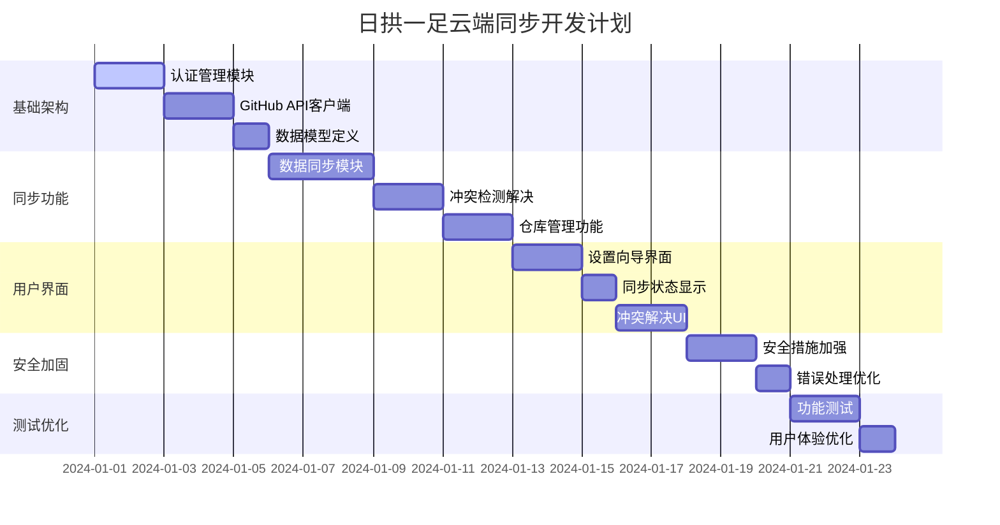

# 📱 日拱一足 - 云端同步产品开发文档 (方案一)

## 🎯 产品概述

**项目名称**: 日拱一足 - 云端同步版  
**产品定位**: 个人修身习惯管理应用，支持GitHub私有仓库数据同步  
**目标用户**: 有GitHub账户的个人用户，希望跨设备同步习惯数据  
**核心价值**: 安全、私密、跨设备的个人习惯数据管理

## 🏗️ 技术架构 (方案一)

### 架构原则
- **用户数据主权**: 每个用户完全控制自己的数据
- **隐私优先**: 所有敏感信息仅存储在用户本地
- **去中心化**: 无需中央服务器，直接连接GitHub
- **安全加密**: 所有本地存储数据进行加密

### 系统架构图
```
┌─────────────────┐    ┌─────────────────┐    ┌─────────────────┐
│   用户设备A     │    │   GitHub API    │    │   用户设备B     │
│                 │    │                 │    │                 │
│  ┌───────────┐  │    │  ┌───────────┐  │    │  ┌───────────┐  │
│  │ 本地加密  │  │◄──►│  │ 私有仓库  │  │◄──►│  │ 本地加密  │  │
│  │ 存储      │  │    │  │ data.json │  │    │  │ 存储      │  │
│  └───────────┘  │    │  └───────────┘  │    │  └───────────┘  │
│                 │    │                 │    │                 │
│  ┌───────────┐  │    │  ┌───────────┐  │    │  ┌───────────┐  │
│  │ 日拱一足  │  │    │  │ REST API  │  │    │  │ 日拱一足  │  │
│  │ 应用      │  │    │  │ V4        │  │    │  │ 应用      │  │
│  └───────────┘  │    │  └───────────┘  │    │  └───────────┘  │
└─────────────────┘    └─────────────────┘    └─────────────────┘
```

### 数据流设计
```
用户操作 → 本地验证 → 加密存储 → GitHub API → 私有仓库
    ↑                                                    ↓
    ← 解密显示 ← 本地缓存 ← 数据同步 ← API响应 ←
```

## 🔧 核心功能模块

### 1. 认证管理模块 (AuthManager)

#### 功能描述
- 安全的GitHub个人访问令牌管理
- 令牌验证和权限检查
- 本地加密存储

#### 技术实现
```typescript
interface AuthManager {
  // 令牌管理
  setToken(token: string): Promise<boolean>
  getToken(): Promise<string | null>
  clearToken(): void
  validateToken(): Promise<boolean>
  
  // 权限检查
  checkPermissions(): Promise<PermissionStatus>
  
  // 用户信息
  getUserInfo(): Promise<GitHubUser>
}

interface PermissionStatus {
  hasRepoAccess: boolean
  hasUserAccess: boolean
  scopes: string[]
}
```

#### 安全措施
- 使用Web Crypto API进行AES-256加密
- 密钥基于用户设备指纹生成
- 令牌验证失败自动清理

### 2. 数据同步模块 (SyncManager)

#### 功能描述
- 双向数据同步机制
- 冲突检测与解决
- 离线缓存支持

#### 技术实现
```typescript
interface SyncManager {
  // 同步操作
  sync(): Promise<SyncResult>
  push(data: HabitsData): Promise<void>
  pull(): Promise<HabitsData>
  
  // 冲突处理
  detectConflict(local: HabitsData, remote: HabitsData): ConflictInfo
  resolveConflict(resolution: ConflictResolution): Promise<HabitsData>
  
  // 状态管理
  getSyncStatus(): SyncStatus
  onSyncStatusChange(callback: (status: SyncStatus) => void): void
}

interface SyncResult {
  success: boolean
  conflicts: ConflictInfo[]
  lastSyncTime: Date
  syncedRecords: number
}

type SyncStatus = 'idle' | 'syncing' | 'error' | 'offline' | 'conflict'
```

#### 同步策略
- **增量同步**: 只同步变更的数据
- **时间戳比较**: 基于最后修改时间判断冲突
- **智能合并**: 自动合并非冲突的变更

### 3. 仓库管理模块 (RepoManager)

#### 功能描述
- GitHub私有仓库自动创建
- 数据文件管理
- 备份历史维护

#### 技术实现
```typescript
interface RepoManager {
  // 仓库操作
  createPrivateRepo(name: string): Promise<Repository>
  getOrCreateDataRepo(): Promise<Repository>
  
  // 文件操作
  readDataFile(): Promise<HabitsData>
  writeDataFile(data: HabitsData): Promise<void>
  
  // 备份管理
  createBackup(data: HabitsData): Promise<string>
  listBackups(): Promise<BackupInfo[]>
  restoreBackup(backupId: string): Promise<HabitsData>
}

interface Repository {
  name: string
  fullName: string
  private: boolean
  url: string
  defaultBranch: string
}
```

#### 仓库结构
```
daily-habits-data/  (私有仓库)
├── data.json       (当前数据)
├── backups/        (备份目录)
│   ├── 2024-01-01.json
│   ├── 2024-01-02.json
│   └── ...
└── README.md       (仓库说明)
```

### 4. 加密存储模块 (SecureStorage)

#### 功能描述
- 本地数据加密存储
- 安全的密钥管理
- 数据完整性校验

#### 技术实现
```typescript
interface SecureStorage {
  // 加密存储
  encrypt(data: any): Promise<string>
  decrypt(encryptedData: string): Promise<any>
  
  // 本地存储
  setItem(key: string, value: any): Promise<void>
  getItem(key: string): Promise<any>
  removeItem(key: string): Promise<void>
  
  // 密钥管理
  generateKey(): Promise<CryptoKey>
  getKey(): Promise<CryptoKey>
}
```

#### 加密方案
- **算法**: AES-256-GCM
- **密钥来源**: 设备指纹 + 用户输入的种子
- **完整性**: HMAC验证

## 🎨 用户界面设计

### 1. 初始设置向导

#### 设置流程
```
欢迎页面 → 权限说明 → 令牌输入 → 验证测试 → 仓库创建 → 数据迁移 → 完成
```

#### 界面要素
- **步骤指示器**: 清晰显示当前进度
- **帮助链接**: 链接到GitHub令牌创建教程
- **安全说明**: 强调数据隐私和安全性
- **测试功能**: 实时验证令牌有效性

#### UI组件设计
```typescript
// 设置向导组件
const SetupWizard = () => {
  const [step, setStep] = useState(1)
  const [token, setToken] = useState('')
  const [isValidating, setIsValidating] = useState(false)
  
  return (
    <Card className="max-w-2xl mx-auto">
      <StepIndicator current={step} total={6} />
      {step === 1 && <WelcomeStep />}
      {step === 2 && <PermissionExplanation />}
      {step === 3 && <TokenInput token={token} setToken={setToken} />}
      {step === 4 && <TokenValidation token={token} />}
      {step === 5 && <RepoCreation />}
      {step === 6 && <DataMigration />}
    </Card>
  )
}
```

### 2. 同步状态界面

#### 状态指示器
- **在线状态**: 绿色圆点 + "已连接"
- **同步中**: 旋转图标 + "同步中..."
- **离线模式**: 橙色圆点 + "离线模式"
- **错误状态**: 红色圆点 + 错误信息

#### 同步控制面板
```typescript
const SyncPanel = () => {
  const { status, lastSync, conflicts } = useSyncStatus()
  
  return (
    <div className="flex items-center gap-4 p-4 bg-gray-50 rounded-lg">
      <SyncStatusIndicator status={status} />
      <div className="flex-1">
        <p className="text-sm font-medium">
          {getSyncStatusText(status)}
        </p>
        {lastSync && (
          <p className="text-xs text-gray-500">
            上次同步: {formatTimeAgo(lastSync)}
          </p>
        )}
      </div>
      {conflicts.length > 0 && (
        <Button variant="outline" onClick={handleResolveConflicts}>
          解决冲突 ({conflicts.length})
        </Button>
      )}
      <Button variant="ghost" size="sm" onClick={manualSync}>
        <RefreshIcon className="w-4 h-4" />
      </Button>
    </div>
  )
}
```

### 3. 冲突解决界面

#### 冲突类型
1. **修改冲突**: 同一习惯在不同设备被修改
2. **删除冲突**: 一端删除，另一端修改
3. **时间冲突**: 系统时间不同步导致的冲突

#### 解决选项
- **保留本地**: 使用当前设备的版本
- **使用远程**: 使用云端的版本
- **智能合并**: 自动合并非冲突部分
- **手动选择**: 逐项选择保留的内容

```typescript
const ConflictResolver = ({ conflicts }: { conflicts: ConflictInfo[] }) => {
  return (
    <Dialog open={conflicts.length > 0}>
      <DialogContent className="max-w-4xl max-h-[80vh] overflow-y-auto">
        <DialogHeader>
          <DialogTitle>数据冲突解决</DialogTitle>
          <DialogDescription>
            检测到数据冲突，请选择要保留的版本
          </DialogDescription>
        </DialogHeader>
        
        {conflicts.map((conflict, index) => (
          <ConflictItem key={index} conflict={conflict} />
        ))}
        
        <DialogFooter>
          <Button variant="outline" onClick={autoResolve}>
            智能解决
          </Button>
          <Button onClick={applyResolution}>
            应用选择
          </Button>
        </DialogFooter>
      </DialogContent>
    </Dialog>
  )
}
```

### 4. 设置管理界面

#### 功能模块
- **账户信息**: 显示GitHub用户信息
- **同步设置**: 自动同步开关、同步间隔
- **数据管理**: 导出、导入、清除数据
- **安全设置**: 更换令牌、加密选项

```typescript
const SettingsPanel = () => {
  return (
    <Card>
      <Tabs defaultValue="account">
        <TabsList>
          <TabsTrigger value="account">账户</TabsTrigger>
          <TabsTrigger value="sync">同步</TabsTrigger>
          <TabsTrigger value="data">数据</TabsTrigger>
          <TabsTrigger value="security">安全</TabsTrigger>
        </TabsList>
        
        <TabsContent value="account">
          <AccountSettings />
        </TabsContent>
        
        <TabsContent value="sync">
          <SyncSettings />
        </TabsContent>
        
        <TabsContent value="data">
          <DataManagement />
        </TabsContent>
        
        <TabsContent value="security">
          <SecuritySettings />
        </TabsContent>
      </Tabs>
    </Card>
  )
}
```

## 🔒 安全实现方案

### 1. 令牌安全存储

#### 加密实现
```typescript
class SecureTokenStorage {
  private async generateKey(seed: string): Promise<CryptoKey> {
    const encoder = new TextEncoder()
    const keyMaterial = await crypto.subtle.importKey(
      'raw',
      encoder.encode(seed),
      'PBKDF2',
      false,
      ['deriveBits', 'deriveKey']
    )
    
    return crypto.subtle.deriveKey(
      {
        name: 'PBKDF2',
        salt: encoder.encode('daily-habits-salt'),
        iterations: 100000,
        hash: 'SHA-256'
      },
      keyMaterial,
      { name: 'AES-GCM', length: 256 },
      false,
      ['encrypt', 'decrypt']
    )
  }
  
  async encryptToken(token: string, deviceFingerprint: string): Promise<string> {
    const key = await this.generateKey(deviceFingerprint)
    const encoder = new TextEncoder()
    const data = encoder.encode(token)
    const iv = crypto.getRandomValues(new Uint8Array(12))
    
    const encrypted = await crypto.subtle.encrypt(
      { name: 'AES-GCM', iv },
      key,
      data
    )
    
    return btoa(JSON.stringify({
      iv: Array.from(iv),
      data: Array.from(new Uint8Array(encrypted))
    }))
  }
}
```

### 2. 设备指纹生成

#### 指纹算法
```typescript
async function generateDeviceFingerprint(): Promise<string> {
  const components = [
    navigator.userAgent,
    navigator.language,
    screen.width + 'x' + screen.height,
    new Date().getTimezoneOffset().toString(),
    navigator.hardwareConcurrency?.toString() || '0'
  ]
  
  const fingerprint = components.join('|')
  const encoder = new TextEncoder()
  const hash = await crypto.subtle.digest('SHA-256', encoder.encode(fingerprint))
  
  return Array.from(new Uint8Array(hash))
    .map(b => b.toString(16).padStart(2, '0'))
    .join('')
}
```

### 3. 权限最小化

#### 令牌权限要求
```typescript
const REQUIRED_SCOPES = [
  'repo'  // 仅需要仓库权限，用于创建和管理私有仓库
]

async function validateTokenPermissions(token: string): Promise<boolean> {
  try {
    const response = await fetch('https://api.github.com/user', {
      headers: {
        'Authorization': `token ${token}`,
        'Accept': 'application/vnd.github.v3+json'
      }
    })
    
    const scopes = response.headers.get('X-OAuth-Scopes')?.split(', ') || []
    return REQUIRED_SCOPES.every(scope => scopes.includes(scope))
  } catch {
    return false
  }
}
```

## 📋 开发任务分解

### 第一阶段：基础架构 (2-3天)

#### 任务列表
- [ ] **创建认证管理模块**
  - 实现令牌加密存储
  - 添加令牌验证功能
  - 创建权限检查机制
  
- [ ] **实现GitHub API客户端**
  - 封装GitHub REST API调用
  - 添加错误处理和重试机制
  - 实现速率限制管理
  
- [ ] **创建数据模型和类型定义**
  - 定义习惯数据结构
  - 创建同步状态类型
  - 添加配置选项接口

#### 技术要点
- 使用Web Crypto API实现加密
- 封装axios或fetch进行API调用
- TypeScript严格类型检查

### 第二阶段：同步功能 (3-4天)

#### 任务列表
- [ ] **实现数据同步模块**
  - 创建双向同步逻辑
  - 添加增量同步支持
  - 实现离线模式缓存
  
- [ ] **开发冲突检测与解决**
  - 时间戳比较算法
  - 冲突类型识别
  - 自动合并策略
  
- [ ] **创建仓库管理功能**
  - 私有仓库自动创建
  - 数据文件读写操作
  - 备份历史管理

#### 技术要点
- 实现乐观锁机制防止并发冲突
- 使用IndexedDB作为离线存储
- Git-like的三路合并算法

### 第三阶段：用户界面 (2-3天)

#### 任务列表
- [ ] **创建设置向导界面**
  - 分步骤引导流程
  - 令牌输入和验证
  - 数据迁移提示
  
- [ ] **开发同步状态显示**
  - 实时状态指示器
  - 同步进度提示
  - 错误信息展示
  
- [ ] **实现冲突解决UI**
  - 冲突详情展示
  - 解决选项选择
  - 差异对比视图

#### 技术要点
- 响应式设计适配移动端
- 无障碍访问支持
- 流畅的动画过渡

### 第四阶段：安全加固 (1-2天)

#### 任务列表
- [ ] **加强安全措施**
  - 实现设备指纹生成
  - 添加数据完整性校验
  - 创建安全审计日志
  
- [ ] **优化错误处理**
  - 网络错误恢复机制
  - 用户友好的错误提示
  - 自动重试和降级策略
  
- [ ] **性能优化**
  - 减少API调用频率
  - 实现智能缓存策略
  - 优化大数据量处理

### 第五阶段：测试与优化 (1-2天)

#### 任务列表
- [ ] **功能测试**
  - 单元测试覆盖核心模块
  - 集成测试验证同步流程
  - 端到端测试用户场景
  
- [ ] **安全测试**
  - 令牌存储安全性验证
  - 数据传输加密测试
  - 权限控制有效性检查
  
- [ ] **用户体验优化**
  - 界面细节打磨
  - 交互流程优化
  - 错误提示改进

## 🚀 实施计划

### 开发时间线



### 里程碑目标

#### 🎯 里程碑1: 基础功能 (第5天)
- ✅ 用户可以安全输入和存储GitHub令牌
- ✅ 应用可以创建私有仓库存储数据
- ✅ 基本的数据读写功能正常

#### 🎯 里程碑2: 同步核心 (第10天)
- ✅ 双向数据同步功能完整
- ✅ 冲突检测和解决机制有效
- ✅ 离线模式基本可用

#### 🎯 里程碑3: 用户体验 (第12天)
- ✅ 设置流程简单易懂
- ✅ 同步状态清晰可见
- ✅ 冲突解决用户友好

#### 🎯 里程碑4: 生产就绪 (第15天)
- ✅ 安全性通过验证
- ✅ 性能满足要求
- ✅ 测试覆盖充分

## 📊 质量保证

### 性能指标
- **首次同步时间**: < 5秒 (100个习惯)
- **增量同步时间**: < 2秒
- **界面响应时间**: < 100ms
- **离线恢复时间**: < 3秒

### 安全标准
- **令牌存储**: AES-256加密
- **数据传输**: HTTPS + TLS 1.3
- **权限控制**: 最小权限原则
- **审计日志**: 关键操作记录

### 兼容性要求
- **浏览器支持**: Chrome 90+, Firefox 88+, Safari 14+
- **移动端适配**: 响应式设计
- **网络环境**: 支持弱网络和离线场景

## 🔄 后续迭代规划

### V1.1 功能增强 (1个月后)
- 数据统计和可视化
- 批量导入导出功能
- 多仓库支持

### V1.2 协作功能 (3个月后)
- 家庭成员数据共享
- 习惯模板市场
- 社交激励机制

### V2.0 平台扩展 (6个月后)
- 移动端原生应用
- 桌面端应用
- 智能提醒系统

---

**文档版本**: 1.0  
**创建日期**: 2024年1月  
**预计开发周期**: 15个工作日  
**开发团队**: 1-2名开发者
