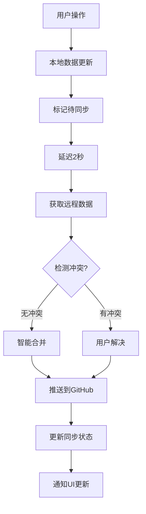
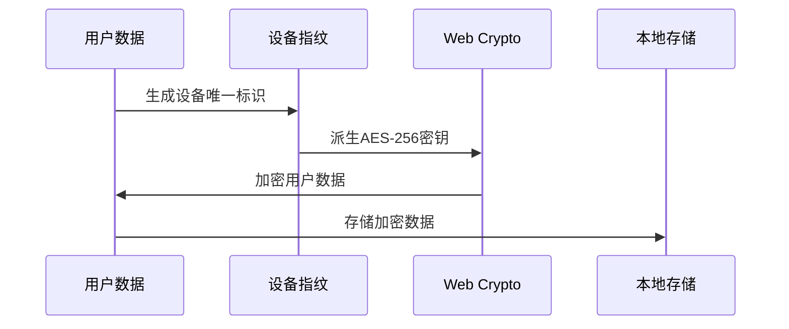

# 🔧 技术栈总览

## 📚 文档索引

| 文档 | 说明 | 适用场景 |
|------|------|----------|
| [README.md](README.md) | 项目总览和快速开始指南 | 初次了解项目 |
| [GITHUB_SYNC_SOLUTION.md](GITHUB_SYNC_SOLUTION.md) | 完整的GitHub同步技术方案 | 技术实现参考 |
| [PRODUCT_SPEC.md](PRODUCT_SPEC.md) | 产品开发规格文档 | 功能开发指导 |
| [REQUIREMENTS.md](REQUIREMENTS.md) | 功能需求详细说明 | 需求分析参考 |
| [DEPLOYMENT.md](DEPLOYMENT.md) | 部署和CI/CD配置 | 项目部署指导 |

## 🏗️ 核心架构

### 前端技术栈
```
Next.js 14 (App Router)
├── React 18
├── TypeScript 5
├── Tailwind CSS 4
├── shadcn/ui + Radix UI
└── Lucide React Icons
```

### 云端同步技术栈
```
GitHub云端同步
├── GitHub REST API
├── Web Crypto API (AES-256)
├── Personal Access Tokens
└── 私有仓库存储
```

### 数据架构
```
数据层级
├── 本地存储 (localStorage)
├── 加密存储 (SecureStorage)
├── 内存缓存 (Map缓存)
└── 远程存储 (GitHub仓库)
```

## 🔄 同步流程图



## 🔐 安全架构

### 数据加密流程


### 权限模型
| 权限类型 | GitHub Scope | 用途 |
|----------|--------------|------|
| 用户信息 | `user` | 获取用户基本信息 |
| 仓库管理 | `repo` | 创建/读写私有仓库 |
| 文件操作 | `repo` | 读写习惯数据文件 |

## 📦 模块结构

### 核心模块
```
lib/
├── types.ts           # TypeScript类型定义
├── secure-storage.ts  # 安全存储模块
├── github-client.ts   # GitHub API客户端
├── auth-manager.ts    # 认证管理器
├── sync-manager.ts    # 同步管理器
└── data-migration.ts  # 数据迁移工具
```

### UI组件
```
components/
├── auth/
│   └── auth-setup.tsx     # GitHub认证设置
├── sync/
│   └── sync-status.tsx    # 同步状态显示
└── ui/                    # shadcn/ui组件库
```

## 🎯 使用场景

### 适合的项目类型
- ✅ 个人工具应用
- ✅ 团队协作工具
- ✅ 笔记和文档应用
- ✅ 配置管理系统
- ✅ 任何需要跨设备同步的应用

### 技术优势
- 🔐 **安全性**: AES-256加密 + 用户完全控制数据
- 🚀 **性能**: 客户端架构 + 智能缓存
- 💰 **成本**: 零额外服务器成本
- 🔧 **可维护**: 模块化设计 + TypeScript
- 📱 **体验**: 离线优先 + 实时同步

## 🚀 快速实现指南

### 1. 基础设置 (15分钟)
```bash
# 安装依赖
npm install

# 复制核心模块
cp lib/types.ts your-project/lib/
cp lib/secure-storage.ts your-project/lib/
cp lib/github-client.ts your-project/lib/
```

### 2. 认证集成 (30分钟)
```bash
# 添加认证管理
cp lib/auth-manager.ts your-project/lib/
cp components/auth/auth-setup.tsx your-project/components/
```

### 3. 同步功能 (45分钟)
```bash
# 添加同步管理
cp lib/sync-manager.ts your-project/lib/
cp lib/data-migration.ts your-project/lib/
cp components/sync/sync-status.tsx your-project/components/
```

### 4. UI集成 (30分钟)
```typescript
// 在主组件中集成
import { authManager } from './lib/auth-manager'
import { syncManager } from './lib/sync-manager'

// 监听状态变化并更新UI
useEffect(() => {
  const unsubscribeAuth = authManager.onAuthStateChange(setAuthState)
  const unsubscribeSync = syncManager.onSyncStateChange(setSyncState)
  
  return () => {
    unsubscribeAuth()
    unsubscribeSync()
  }
}, [])
```

## 💡 最佳实践

### 性能优化
1. **防抖同步**: 延迟2秒避免频繁API调用
2. **增量同步**: 只同步变更的数据
3. **智能缓存**: 缓存GitHub API响应
4. **压缩存储**: 优化数据存储格式

### 安全考虑
1. **令牌加密**: 使用AES-256加密存储GitHub PAT
2. **设备指纹**: 基于设备特征生成加密密钥
3. **权限最小化**: 只请求必要的GitHub权限
4. **数据隔离**: 每个用户的数据存储在独立的私有仓库

### 用户体验
1. **渐进增强**: 从本地存储平滑升级到云端同步
2. **离线优先**: 网络断开时继续工作
3. **状态透明**: 实时显示同步状态和进度
4. **错误恢复**: 智能错误处理和自动重试

## 🔍 故障排除

### 常见问题
| 问题 | 原因 | 解决方案 |
|------|------|----------|
| 认证失败 | 令牌无效或权限不足 | 重新生成PAT，确保选择`repo`权限 |
| 同步冲突 | 多设备并发修改 | 使用冲突解决界面手动处理 |
| 网络错误 | API调用失败 | 检查网络连接，等待自动重试 |
| 存储错误 | 本地存储异常 | 清除本地数据，从云端重新同步 |

### 调试技巧
```typescript
// 启用调试日志
const config = {
  enableSyncDebugLogs: true,
  enableErrorReporting: true
}

// 手动检查同步状态
console.log('Auth State:', authManager.getAuthState())
console.log('Sync State:', syncManager.getSyncState())

// 手动触发同步
syncManager.manualSync().then(result => {
  console.log('Sync Result:', result)
}).catch(error => {
  console.error('Sync Error:', error)
})
```

---

## 📞 技术支持

- 📖 完整方案: [GITHUB_SYNC_SOLUTION.md](GITHUB_SYNC_SOLUTION.md)
- 🚀 产品文档: [PRODUCT_SPEC.md](PRODUCT_SPEC.md)
- 📋 需求文档: [REQUIREMENTS.md](REQUIREMENTS.md)
- 🚀 部署指南: [DEPLOYMENT.md](DEPLOYMENT.md)

**适用于任何需要安全、可靠跨设备数据同步的Web应用程序。**

